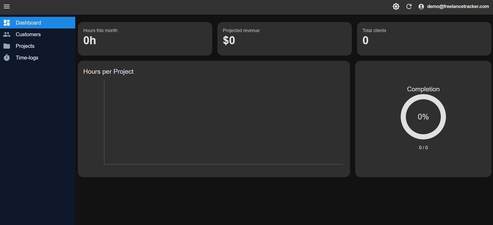
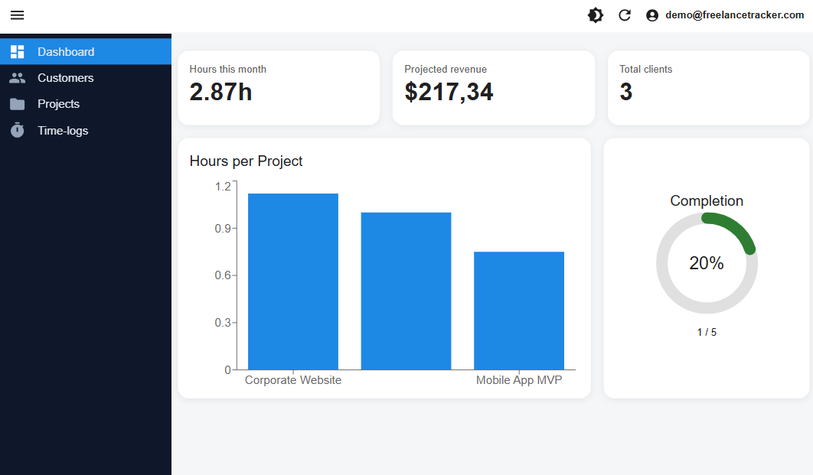
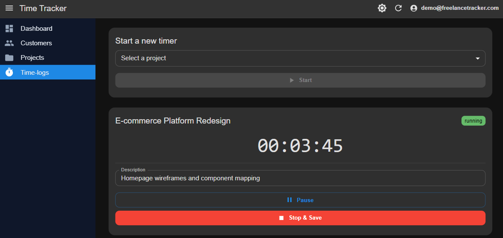
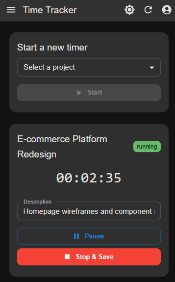
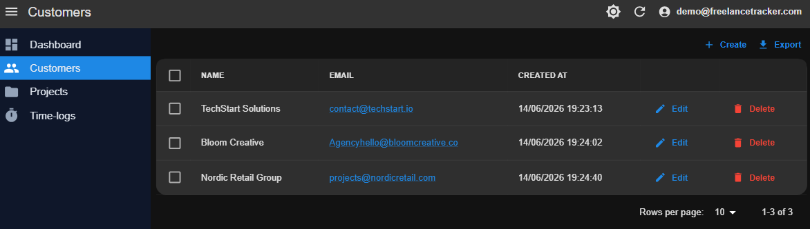
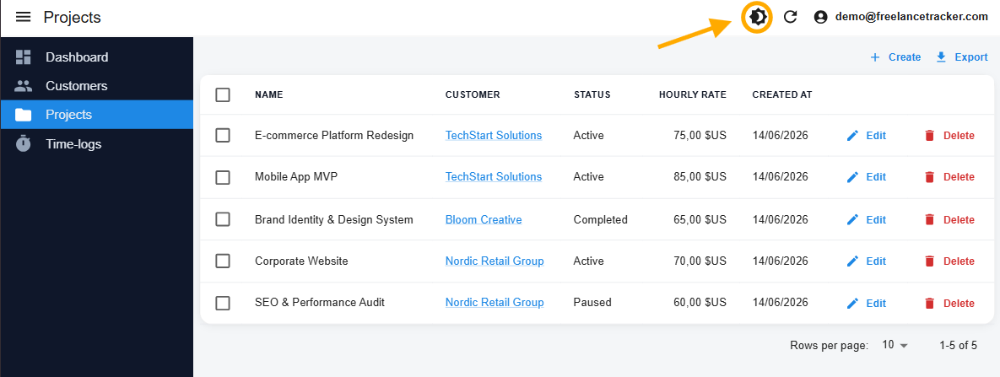

# Freelance Tracker MVP

A full-stack Micro-SaaS for freelancers to track time, manage clients and
projects, and visualize monthly performance — built to demonstrate enterprise-grade
architecture patterns using React Admin, Node.js and Supabase.



---

## 🚀 Live Demo

| Environment                 | URL                                             |
| --------------------------- | ----------------------------------------------- |
| **Production**              | `https://freelance-tracker-mvp-five.vercel.app` |
| **Preproduction (Staging)** | _(Vercel automatic preview deployment)_         |

| Field    | Value                       |
| -------- | --------------------------- |
| Email    | `demo@freelancetracker.com` |
| Password | `Demo1234!`                 |

> The demo account is pre-loaded with sample clients, projects and time logs.

---

## 🛠️ Tech Stack

### Frontend

- **React + Vite + TypeScript** (strict mode)
- **React Admin v5** — declarative CRUD framework
- **Material-UI v5** — component library with custom light/dark theme
- **Axios** — HTTP client with JWT interceptor
- **Recharts** — dashboard charts

### Backend

- **Node.js + Express + TypeScript** (strict mode)
- **Zod** — request body validation
- **Supabase JS SDK** — database operations and JWT validation

### Database & Auth

- **Supabase (PostgreSQL)** — hosted database
- **Supabase Auth** — JWT-based authentication
- **Row Level Security (RLS)** — data isolation at database level

---

## 🏗️ Architecture Overview

```
┌─────────────────────────────────────────────────────┐
│                    FRONTEND                         │
│  React Admin                                        │
│  ├── authProvider → Supabase Auth                   │
│  ├── dataProvider → Node.js API (JWT in headers)    │
│  ├── Resources: Customers, Projects, Time Logs      │
│  └── Custom: Dashboard, Time Tracker                │
└────────────────────────┬────────────────────────────┘
                         │ HTTPS + Bearer Token
┌────────────────────────▼────────────────────────────┐
│                    BACKEND                          │
│  Express API                                        │
│  ├── auth.middleware → JWT validation               │
│  ├── validate.middleware → Zod schemas              │
│  └── Modules: customers, projects, time-logs,       │
│               dashboard                             │
└────────────────────────┬────────────────────────────┘
                         │ Service Role Key
┌────────────────────────▼────────────────────────────┐
│                   SUPABASE                          │
│  PostgreSQL + RLS policies                          │
│  Tables: profiles, customers, projects, time_logs   │
└─────────────────────────────────────────────────────┘
```

---

## ✨ Key Features

- **🔐 Secure authentication** — Supabase Auth with server-side JWT validation on every request
- **👥 Client management** — full CRUD with form validation
- **📁 Project management** — associate projects to clients with status tracking and hourly rates
- **⏱️ Real-time time tracker** — multiple simultaneous timers per project with pause/resume and localStorage persistence
- **📊 Dashboard** — monthly KPIs (hours, projected revenue, clients) and hours-per-project bar chart
- **🌙 Light/Dark mode** — custom MUI theme with automatic toggle

---

## 📸 Screenshots

### Dashboard



### Time Tracker

#### Desktop View



#### Mobile View



### Customers



### Projects



---

## 📐 Key Technical Decisions

**Why React Admin?**
Instead of building CRUD interfaces manually, React Admin provides pagination,
sorting, filtering and form validation out of the box. The challenge was adapting
its provider pattern to a custom Node.js API — implemented via a custom
`dataProvider` that maps React Admin's methods to REST endpoints with automatic
JWT injection.

**Why a custom backend instead of calling Supabase directly?**
A dedicated Express layer enables centralized JWT validation, Zod input validation,
business logic isolation (revenue calculations, metric aggregations) and the
`Content-Range` header protocol required by React Admin's pagination system.

**Why timestamp-based timers instead of counters?**
The `useTimer` hook calculates elapsed time using `Date.now()` differences instead
of incrementing a counter every second. This keeps the timer accurate even when
the browser tab loses focus, freezes or the user navigates away.

---

## 🗂️ Repository Structure

```
freelance-tracker-mvp/
├── frontend/          # React + Vite + React Admin
│   └── README.md      # Frontend architecture details
├── backend/           # Node.js + Express + TypeScript
│   └── README.md      # Backend architecture details
└── README.md          # This file
```

---

## 🚀 Getting Started

### Prerequisites

- Node.js 18+
- A Supabase project — run `backend/supabase/schema.sql` in the Supabase SQL Editor to create all tables, RLS policies and indexes

### Installation

```bash
# Clone the repository
git clone https://github.com/lilisepulveda96-svg/freelance-tracker-mvp.git

# Install frontend dependencies
cd frontend && npm install

# Install backend dependencies
cd ../backend && npm install
```

### Environment Variables

```bash
# Frontend
cp frontend/.env.example frontend/.env

# Backend
cp backend/.env.example backend/.env
```

### Run in Development

```bash
# Terminal 1 — Backend
cd backend && npm run dev

# Terminal 2 — Frontend
cd frontend && npm run dev
```

---

## 🚀 Roadmap

- [ ] Task management within projects
- [ ] Historical month selector in dashboard
- [ ] Time breakdown by task
- [ ] OAuth login (Google, GitHub)
- [ ] PDF invoice generation
- [ ] Deploy to Railway + Vercel
